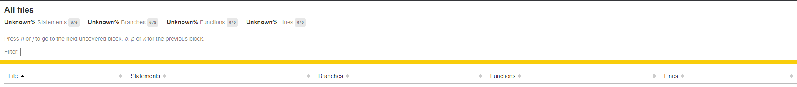
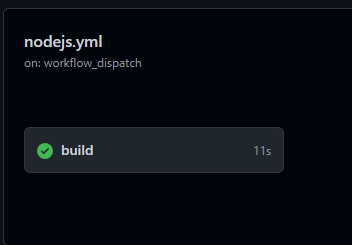

# [Práctica Espree Logging](https://ull-esit-gradoii-pl.github.io/practicas/esprima-logging)

### Procesadores de lenguajes 2022-2023

#### Juan Guillermo Zafra Fernández alu0101353647

## Resumen de lo aprendido

As complex as the AST tree looks like, it doesn't have any reason to not be manageable. Accessing its values
is easy as a `node.body`, which is a really handy implementation.

Using simple conditionals and variables you can build up a compilator and write down metaprograms, due to the 
information stated above. 

NPM and all the other stuff not related to the program itself was rather annoying to set up, with a thousand things to move press and log in into. I'm a rather simple man.

## El ejecutable

El ejecutable está en `bin/logging.js`

```
✗ bin/logging.js -h
Usage: jslogging [options] <filename>

Adds logs to javascript code

Arguments:
  filename                 file with the original code

Options:
  -V, --version            output the version number
  -o, --output <filename>  file in which to write the output (default: "output.js")
  -h, --help               display help for command
```

```
git:(main) ✗ cat test/test1.js 
function foo(a, b) {   
    var x = 'blah';   
    var y = (function () {
      return 3;
    })();
  }     
foo(1, 'wut', 3);
➜  git:(template) ✗ bin/logging.js test/test1.js -o salida.js
File read succesfully
Output written succesfully in salida.js
➜  git:(template) ✗ node salida.js
Entering foo(1, wut) at line 1
Entering <anonymous function>() at line 3
```

Below a piece of code with my doing:

```bash
(route)$ ./jslogging -o madeUp.js test/test3.js
(route)$ cat madeUp.js
function foo(a, b, c) {
    console.log(`Entering foo(${ a }, ${ b }, ${ c }) at line 1`);
    let x = 'tutu';
    let y = function (x) {
        console.log(`Entering <anonymous function>(${ x }) at line 3`);
        return x * x;
    }(2);
    let z = (e => {
        console.log(`Entering <anonymous function>(${ e }) at line 4`);
        return e + 1;
    })(4);
    console.log(x, y, z);
}
foo(1, 'wut', 3);
```

## CLI con [Commander.js](https://www.npmjs.com/package/commander)

Commander is a useful library to not program by hand all the options and the messages, to the point of also providing a helper in case you misstyped any of the options,
it will ask if that one's the one you were looking for. Very handy!

## Reto 1: Soportar funciones flecha

This was a fairly easy task. Using [the AST explorer](https://astexplorer.net/#/gist/30fd4865621d99718672b1cd53d6c3c9/latest), I clicked twice on the *fat arrow function*, 
and I was directed to it's name. From that, just add the tag to the or. Below, the code:

```javascript
function addLogging(code) {
  let ast = espree.parse(code, {ecmaVersion:6, loc:true});

  estraverse.traverse(ast, {
    enter: function(node, parent) {
      if (node.type === 'FunctionDeclaration' ||
        node.type === 'FunctionExpression' ||
        node.type === 'ArrowFunctionExpression') {
        addBeforeCode(node);
      }
    }
  });
  return escodegen.generate(ast);
}
```

## Reto 2: Añadir el número de línea

This was a bit harder, I had to enable `loc: true` at the code above for it to get the lines as well as more info. Once done that, I could simply get the lines 
at an argument at the AST.

```javascript
function addBeforeCode(node) {
  let name = node.id ? node.id.name : '<anonymous function>';
  let line = node.loc.start.line; // Line is saved here
  let params = [];
  for (let i = 0; i < node.params.length; ++i) {
    if (i === 0) {
      params.push(`\$\{ ${node.params[i].name} \}`);
    } else {
      params.push(` \$\{ ${node.params[i].name} \}`);
    }
  }

  let beforeCode = `console.log(\`Entering ${name}(${params}) at line ${line}\`);`; // Here you have the line
  let beforeNodes = espree.parse(beforeCode, {ecmaVersion:6}).body; // Is an Array of ASTs
  node.body.body = beforeNodes.concat(node.body.body);
}
```

## Reto 3: Añadir los argumentos a el output de las funciones

This was perhaps the hardest one, because the output had to include stuff to not be interpolated, and thus 
had to escape characters and factor it as the tests liked.

The code for it is above, at the console.log, and the parameters are iterated through a loop, pushed to a for and simply outputted 
once concatenated.

## Tests

Well, the tests run and go well: have a screenshot.


## Mocking distinto

Mocking has also changed to fit more stuff:

```js
  let oldLog = console.log; // mocking console.log
  let result = [];
  let resultantString;
  console.log = function (...s) {
      if (s.length > 1) {
          let sString = s.join(' ');
          s = [sString];
      }
      result.push(s);
      resultantString = result.join('\n');
  };
  eval(output);
```

## NPM

Using the commands:
```bash
 npm login
```
And setting all the information up (the notes' codes don't work at all),
we set up the information in bash.

```bash
 npm publish --access=public
```
With that we publish it.


## Docs

The command `npm run cov` will run the coverage and set the folder up for GitHub.

At GitHub, the page will be posted [here](https://ull-esit-pl-2223.github.io/espree-logging-juan_guillermo-zafra-alu0101353647/).



## Continuous Integration

We simply set the very same `nodejs.yml` as the previous assignment:

```yml

# Write your workflow for CI here
name: CI

# Controls when the workflow will run
on:
  # Triggers the workflow on push or pull request events but only for the $default-branch branch
  push:
    branches: [ master ]
  pull_request:
    branches: [ master ]

  # Allows you to run this workflow manually from the Actions tab
  workflow_dispatch:

# A workflow run is made up of one or more jobs that can run sequentially or in parallel
jobs:
  # This workflow contains a single job called "build"
  build:
    # The type of runner that the job will run on
    runs-on: ubuntu-latest

    # Steps represent a sequence of tasks that will be executed as part of the job
    steps:
      # Checks-out your repository under $GITHUB_WORKSPACE, so your job can access it
      - uses: actions/checkout@v2

      # Runs a single command using the runners shell
      - name: Set up node
        uses: actions/setup-node@v2

      # Runs a set of commands using the runners shell
      - name: Install dependencies
        run: npm i
      
      - name: Run tests
        run: npm run test
```
And it looks like this in GitHub:



